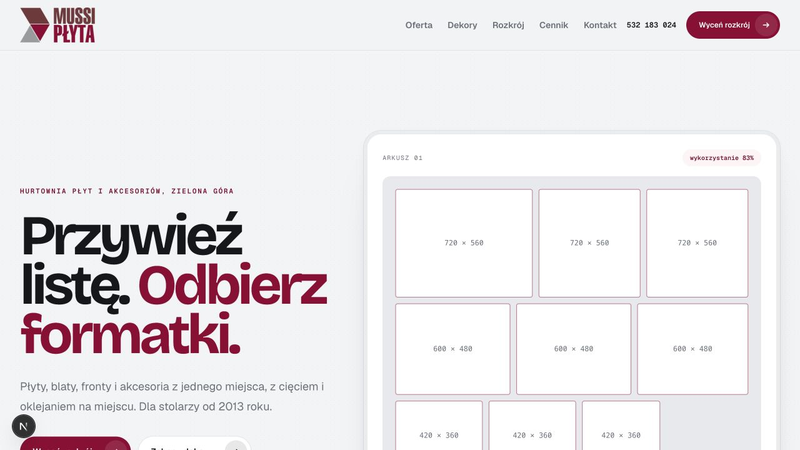
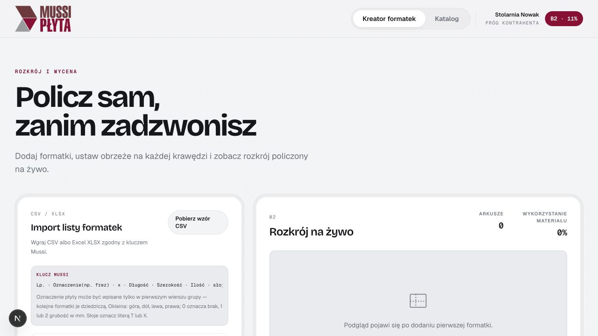

# Mussi B2B — zakres funkcjonalny CRM/ERP

Data: 2026-08-29

## Cel produktu

Portal ma prowadzić stolarza od kalkulacji projektu do odbioru kompletnego zamówienia bez potrzeby telefonicznego ustalania podstawowych informacji. Klient ma zawsze widzieć:

- co dokładnie zamawia,
- jaka jest jego końcowa cena,
- co jest dostępne i zarezerwowane,
- do kiedy może zmienić zamówienie,
- kiedy zamówienie będzie gotowe,
- co aktualnie blokuje realizację,
- jakie dokumenty i działania są jeszcze potrzebne.

System powinien składać się z trzech wyraźnie oddzielonych powierzchni:

1. publiczna strona Mussi — oferta, pozyskanie klienta i SEO,
2. portal klienta B2B — katalog, kalkulacja, zamówienia, dokumenty i marża stolarza,
3. panel operacyjny Mussi — klienci, rabaty, stany, rezerwacje, produkcja, dostawy i wyjątki.

## Audyt istniejącej ścieżki

### Krok 1 — wejście na stronę

Stan: dobry wizualnie, niepełny produktowo.

Mocne strony:

- jasna obietnica „lista → formatki”,
- widoczny rozkrój buduje zaufanie,
- łatwe przejście do katalogu i kreatora.

Braki:

- brak wejścia do panelu klienta i informacji o trwających zamówieniach,
- brak rozdzielenia publicznej strony od prywatnego portalu,
- publiczny cennik nie powinien być źródłem cen dla zalogowanego klienta.

### Krok 2 — katalog klienta

Stan: dobry fundament, wymaga zmiany polityki cen i stanów.

Mocne strony:

- klient widzi swój próg i cenę dopasowaną do konta,
- filtry odpowiadają branży,
- stan magazynowy jest widoczny przed rozpoczęciem kalkulacji.

Ryzyka:

- widoczna jest cena katalogowa oraz cena po rabacie; zgodnie z wymaganiem klient powinien widzieć wyłącznie swoją cenę efektywną,
- stan „na stanie” nie mówi, czy ilość wystarczy dla bieżącego koszyka,
- brak terminu dostawy dla pozycji „na zamówienie”,
- brak wariantów, opakowań, jednostek i kompatybilności okuć.

### Krok 3 — kreator

Stan: działa jako kalkulator, nie jest jeszcze procesem zamówienia.

Mocne strony:

- import klucza Mussi,
- wizualny wybór krawędzi i obrzeża,
- automatyczny rozkrój i wycena usług.

Braki krytyczne:

- brak koszyka łączącego płyty, usługi, okucia i akcesoria,
- brak wersji kalkulacji i wersji zamówienia,
- brak rezerwacji stanów i potwierdzenia terminu,
- brak danych dostawy/odbioru, płatności i dokumentów,
- brak przejścia „kalkulacja → zamówienie → status”,
- brak prywatnego kalkulatora marży stolarza.

## Docelowa ścieżka klienta

1. Klient loguje się do organizacji swojej stolarni.
2. Dashboard pokazuje zamówienia wymagające uwagi, terminy, blokady i dokumenty.
3. Klient tworzy projekt lub kopiuje wcześniejsze zamówienie.
4. Dodaje płyty, rozkrój, obrzeża, usługi, okucia i akcesoria.
5. System liczy wyłącznie ceny przypisane temu klientowi.
6. System sprawdza dostępność całego koszyka i proponuje termin.
7. Klient może osobno obliczyć własną marżę i cenę dla swojego odbiorcy.
8. Klient składa zamówienie i otrzymuje numer, migawkę ceny oraz termin.
9. Przez 48 godzin może tworzyć kolejne wersje zamówienia.
10. Po upływie 48 godzin edycja zostaje zablokowana.
11. Portal pokazuje realizację do gotowości, odbioru lub dostawy.
12. Faktura i dokumenty są dostępne w zamówieniu.

## Model statusów zamówienia

| Status | Co widzi klient | Czy można edytować |
|---|---|---|
| Szkic | Niepełny koszyk, bieżąca kalkulacja | Tak |
| Do potwierdzenia | Kontrola adresu, płatności, stanów i terminu | Tak |
| Złożone — okno zmian | Odliczanie do końca 48 godzin | Tak, przez utworzenie nowej wersji |
| Zablokowane | Zamówienie przekazane do realizacji | Nie |
| Oczekuje na towar | Brakująca pozycja, przewidywana dostawa i wpływ na termin | Nie; tylko wniosek o zmianę |
| W produkcji | Etap cięcia/oklejania/kompletacji | Nie |
| Gotowe do odbioru | Miejsce, godziny i dokument wydania | Nie |
| W dostawie | Termin i dane dostawy | Nie |
| Zrealizowane | Dokumenty, ponowienie zamówienia | Nie |
| Anulowane | Powód, osoba i data decyzji | Nie |

### Reguła 48 godzin

- Okno zmian jest liczone od przyjęcia zamówienia przez system, nie od rozpoczęcia szkicu.
- Każda zmiana tworzy nową wersję; poprzednia wersja pozostaje w historii.
- Każda wersja ponownie przelicza cenę, dostępność i termin.
- Licznik pokazuje konkretną datę i godzinę, nie tylko „2 dni”.
- Po terminie wszystkie kontrolki edycji są blokowane również po stronie serwera.
- Po blokadzie klient może wysłać „wniosek o zmianę”, ale nie modyfikuje nim zamówienia bez decyzji Mussi.
- Operacyjna zmiana wykonana przez pracownika wymaga powodu i pozostawia ślad w audycie.

### Reguła terminu pięciu dni

System musi przechowywać osobno:

- termin oczekiwany — wynikający ze standardowych pięciu dni,
- termin potwierdzony — po rezerwacji stanów i sprawdzeniu produkcji,
- aktualną prognozę — zmienianą przez wyjątki magazynowe lub produkcyjne.

Klient nie może zobaczyć „5 dni” jako gwarancji, jeśli część koszyka nie jest dostępna. Przed złożeniem zamówienia system powinien pokazać jeden z komunikatów:

- „towar zarezerwowany — realizacja do …”,
- „część towaru oczekuje na dostawę — przewidywany termin …”,
- „termin wymaga potwierdzenia przez Mussi”.

Do ustalenia przed implementacją: czy pięć dni oznacza dni kalendarzowe czy robocze, jaka jest godzina graniczna oraz który kalendarz świąt obowiązuje.

## Ceny i rabaty

### Źródła ceny

Silnik cenowy powinien obsługiwać:

- cennik bazowy z datą obowiązywania,
- rabat domyślny klienta,
- rabat per kategoria,
- rabat per producent,
- rabat per konkretny produkt,
- osobne stawki usług,
- ceny kontraktowe i czasowe promocje,
- minimalną cenę/marżę ochronną,
- jednostki: arkusz, m², mb, komplet, opakowanie i sztuka,
- progi ilościowe,
- reguły zaokrągleń i VAT.

Najbardziej szczegółowa aktywna reguła powinna wygrywać. Każde zamówienie zapisuje niezmienną migawkę użytych cen i reguł.

### Co widzi klient

- tylko końcową cenę przypisaną do jego konta,
- cenę netto i podsumowanie VAT/brutto w odpowiednim miejscu,
- datę ważności kalkulacji,
- informację, że jest to „Twoja cena”, bez pokazywania ceny katalogowej,
- pełne podsumowanie: materiał, usługi, obrzeża, okucia, akcesoria, dostawa i podatki.

Cena bazowa, mechanizm rabatowy i minimalna marża Mussi pozostają dostępne wyłącznie w panelu pracownika.

## Okucia i akcesoria

Katalog musi obsłużyć warianty i zależności typowe dla branży:

- zawiasy z kątem otwarcia, prowadnikiem i typem nakładania,
- prowadnice i szuflady z długością, udźwigiem i kolorem,
- cargo z szerokością korpusu i stroną montażu,
- uchwyty z rozstawem,
- systemy LED z mocą, temperaturą barwową, profilem i zasilaczem,
- obrzeża z dekorem, grubością, szerokością i rolką,
- elementy sprzedawane w kompletach i opakowaniach.

System powinien:

- filtrować warianty kompatybilne z projektem,
- sugerować brakujące elementy kompletu,
- ostrzegać przed niekompatybilnym zestawem,
- pokazywać dostępność wymaganej ilości, nie tylko ogólny stan,
- pozwalać zaakceptować lub odrzucić zamiennik,
- obsługiwać częściową realizację tylko po wyraźnej zgodzie klienta.

## Prywatny kalkulator marży stolarza

> **Nieaktualne od 30 sierpnia 2026.** Klient odrzucił ten moduł. Portal ma być
> ułatwieniem dla hurtowni i kanałem zamówień online, a nie narzędziem pracy
> stolarza. Sekcję zostawiamy dla historii decyzji, nie do realizacji.

To osobny moduł od zamówienia Mussi. Pozwala dodać:

- koszt zakupu w Mussi,
- robociznę własną,
- transport i montaż,
- elementy kupowane u innych dostawców,
- bufor ryzyka i odpadu,
- narzut procentowy albo oczekiwaną marżę,
- cenę netto i brutto dla końcowego klienta.

Narzut i marża muszą być opisane osobno, ponieważ nie są tym samym wskaźnikiem. Dane o marży stolarza powinny być prywatne dla jego organizacji i niewidoczne dla handlowców Mussi. Kalkulację można zapisać przy projekcie i wyeksportować jako ofertę bez ujawniania cen zakupu.

## Panel klienta

### Dashboard

- „wymaga Twojej uwagi”,
- zamówienia w realizacji,
- licznik okna zmian,
- najbliższe odbiory/dostawy,
- opóźnienia i braki magazynowe,
- szkice i ostatnie kalkulacje,
- dokumenty oczekujące na pobranie,
- limit kupiecki i zaległości, jeśli Mussi zdecyduje się je udostępniać.

### Szczegóły zamówienia

- numer i nazwa projektu,
- aktualny status i pełna oś czasu,
- termin oczekiwany, potwierdzony i aktualna prognoza,
- ostatnia zaakceptowana wersja,
- pełna lista produktów i usług,
- rozkrój i pliki źródłowe,
- historia zmian z osobą i datą,
- dokumenty: potwierdzenie, WZ, faktura, korekta,
- odbiór lub dostawa,
- kontakt do osoby prowadzącej wyjątek.

### Konto organizacji

- wiele osób w jednej stolarni,
- role: właściciel, kupujący, kosztorysant, podgląd,
- limity akceptacji zamówień,
- adresy i dane fakturowe,
- domyślna forma dostawy i płatności,
- historia logowań i aktywnych sesji.

## Panel operacyjny Mussi

- klienci, oddziały, kontakty i status współpracy,
- cenniki oraz reguły rabatowe z datami obowiązywania,
- limit kupiecki, forma płatności i blokady handlowe,
- zamówienia i kolejka wyjątków,
- rezerwacje magazynowe,
- kolejka cięcia, oklejania i kompletacji,
- plan odbiorów i dostaw,
- obsługa braków, zamienników i częściowych realizacji,
- dokumenty oraz integracja faktur,
- audyt zmian ceny, rabatu, terminu i zamówienia.

## Magazyn i rezerwacje

Sam stan liczbowy nie wystarczy. Potrzebne są:

- stan dostępny, fizyczny, zarezerwowany i oczekiwany,
- twarda rezerwacja po złożeniu zamówienia,
- wygasanie rezerwacji dla nieopłaconych/niepotwierdzonych zamówień,
- ochrona przed podwójną sprzedażą przy równoczesnych zamówieniach,
- rezerwacja pełnych arkuszy, resztek i ilości obrzeża,
- data dostawy dla brakującego produktu,
- polityka zamienników,
- ponowne przeliczenie terminu po każdej zmianie wersji.

## Dokumenty i rozliczenia

- kalkulacja nie jest zamówieniem,
- potwierdzenie zamówienia zapisuje wersję i cenę,
- WZ jest powiązane z wydaniem,
- faktura i korekta są powiązane z zamówieniem,
- płatności: przedpłata, przelew terminowy, pobranie lub limit kupiecki — zależnie od klienta,
- integracja KSeF powinna być przewidziana jako osobny, odporny na awarie adapter,
- status KSeF nie może blokować pracy magazynu bez kontrolowanej ścieżki awaryjnej.

## Trzy podmioty i podział fakturowania

Hurtownia działa operacyjnie jako trzy podmioty odpowiedzialne za różne części sprzedaży:

1. podmiot sprzedający płyty, blaty, fronty i obrzeża,
2. podmiot sprzedający okucia i akcesoria,
3. Stolarnia U Kazia realizująca cięcie, oklejanie i pozostałe usługi stolarskie.

Jedno zamówienie klienta może wygenerować od jednego do trzech dokumentów sprzedaży. Pracownik hurtowni musi mieć możliwość przypisania każdej grupy pozycji do podmiotu wystawiającego fakturę oraz ręcznego zmienienia sugerowanego przypisania przed wystawieniem dokumentów.

System powinien:

- proponować podmiot na podstawie kategorii produktu lub usługi,
- liczyć osobne wartości netto, VAT i brutto dla każdego podmiotu,
- blokować wystawienie dokumentu, jeżeli pozycja nie ma podmiotu albo dane formalne podmiotu są niekompletne,
- przechowywać na dokumencie migawkę nazwy prawnej, NIP, adresu, rachunku i serii numeracji,
- obsługiwać osobne serie faktur, korekt, WZ i połączenia KSeF dla każdego podmiotu,
- zapisywać w audycie każdą zmianę podmiotu wraz z użytkownikiem, datą i powodem,
- pokazywać klientowi komplet dokumentów pod jednym numerem zamówienia, mimo że wystawiły je różne podmioty.

Stan realizacji we frontendzie, po zadaniu 008:

- propozycja podmiotu po kategorii: działa,
- osobne netto, VAT i brutto na podmiot: działa,
- blokada wystawienia przy braku podmiotu lub niekompletnych danych: działa,
- migawka danych rejestrowych na dokumencie: działa,
- serie numeracji faktur, korekt i WZ oraz status KSeF: pola i numeracja działają, integracji KSeF brak,
- audyt zmiany podmiotu z powodem, autorem i datą: działa w sesji, bez zapisu w bazie,
- komplet dokumentów u klienta pod jednym numerem zamówienia: działa.

Do uzupełnienia przed backendem pozostają pełne dane prawne wszystkich trzech podmiotów. Podmiot płytowy ma nazwę i adres, ale nie ma NIP-u, rachunku ani serii numeracji, więc również nie może dziś wystawić dokumentu.

## Bezpieczeństwo

Minimalny poziom projektu:

- pełna izolacja danych pomiędzy firmami klientowskimi,
- uprawnienia sprawdzane na serwerze dla każdej operacji,
- role i zasada najmniejszych uprawnień,
- MFA przynajmniej dla administratorów i pracowników Mussi,
- wersjonowanie i dziennik zmian zamówień, cen oraz rabatów,
- bezpieczne, czasowe linki do dokumentów,
- walidacja zawartości plików XLSX/CSV, limity rozmiaru i skanowanie malware,
- ochrona przed wielokrotnym złożeniem tego samego zamówienia,
- szyfrowanie transmisji oraz danych wrażliwych,
- rotacja sekretów i kopie zapasowe z testem odtworzenia,
- monitoring podejrzanych logowań i eksportów danych,
- retencja danych i usuwanie zgodne z ustaloną polityką.

Weryfikacja bezpieczeństwa powinna bazować na OWASP ASVS, a nie wyłącznie na skanerze zależności.

## SEO

- SEO obejmuje tylko publiczną stronę, ofertę i publiczne kategorie,
- panel klienta, koszyk, kalkulacje, dokumenty i zamówienia muszą być `noindex`,
- spersonalizowanych cen nie należy umieszczać w publicznych danych strukturalnych ani cache współdzielonym między klientami,
- publiczna strona wymaga kanonicznych adresów, sitemap, robots, metadanych, danych firmy i prawidłowej hierarchii nagłówków,
- wydajność publicznej strony powinna być monitorowana przez Core Web Vitals.

## Testy bez niekończącej się regresji

Największą część logiki należy zamknąć w deterministycznych regułach domenowych:

- testy tablic decyzyjnych dla rabatów i cen,
- testy czasu dla 48 godzin, weekendów, świąt i godziny granicznej,
- testy maszyny stanów zamówienia,
- testy współbieżnych rezerwacji magazynowych,
- testy niezmienności migawki ceny,
- testy izolacji danych organizacji,
- testy importu plików i złośliwych formatów,
- testy kontraktowe integracji ERP/KSeF,
- mały zestaw E2E tylko dla krytycznych ścieżek: złożenie, zmiana, blokada, brak magazynowy i wydanie.

E2E nie powinny próbować pokrywać każdej kombinacji produktu. Kombinacje cen, terminów i statusów są tańsze oraz stabilniejsze jako testy jednostkowe i kontraktowe.

## Integracje konieczne do pełnego systemu

- źródło produktów, wariantów, stanów i cen,
- ERP lub system magazynowy,
- KSeF/fakturowanie,
- operator e-mail/SMS,
- płatności, jeśli pojawi się przedpłata online,
- przewoźnik lub planowanie własnej dostawy,
- monitoring błędów i audyt zdarzeń,
- eksport księgowy i raporty handlowe.

Każda integracja musi mieć kolejkę ponowień, identyfikator idempotencji, widoczny status oraz procedurę ręcznej obsługi błędu.

## Etapy realizacji

### Etap 0 — decyzje domenowe

Ustalenie terminów, kalendarza, momentu rezerwacji, płatności, uprawnień, rabatów, częściowych realizacji i integracji.

### Etap 1 — działający front panelu klienta

Dashboard, lista zamówień, szczegóły, licznik 48 godzin, oś statusu, katalog okuć, koszyk wielobranżowy, końcowa wycena i kalkulator marży na danych demonstracyjnych.

### Etap 2 — rdzeń transakcyjny

Logowanie organizacji, uprawnienia, cenniki klienta, wersjonowanie zamówień, rezerwacje, maszyna stanów, audyt i powiadomienia.

### Etap 3 — operacje i dokumenty

Panel Mussi, produkcja, wydania, dostawy, płatności, faktury i KSeF.

### Etap 4 — utwardzenie

Testy obciążeniowe i bezpieczeństwa, odtwarzanie kopii, monitoring, procedury awaryjne, szkolenie pracowników i pilotaż z kilkoma stolarniami.

## Decyzje wymagane przed implementacją backendu

1. Czy pięć dni oznacza dni robocze czy kalendarzowe?
2. Od którego zdarzenia liczymy pięć dni: złożenie, opłacenie czy akceptacja Mussi?
3. Czy każda zmiana w pierwszych 48 godzinach resetuje termin realizacji?
4. Kiedy towar jest rezerwowany i jak długo rezerwacja może czekać na płatność?
5. Czy klient może zgodzić się na częściową realizację lub zamiennik?
6. Które rabaty się łączą i jaka jest kolejność ich stosowania?
7. Czy rabat ma być widoczny procentowo, czy tylko jako końcowa „Twoja cena”?
8. Jak obsługiwane są transport, odbiór osobisty i minimalna wartość zamówienia?
9. Jakie formy płatności i limity kupieckie obowiązują poszczególnych klientów?
10. Jaki system jest źródłem prawdy dla produktów, stanów, cen, klientów i faktur?

## Źródła kontrolne

- Ministerstwo Finansów: https://ksef.podatki.gov.pl/informacje-ogolne-ksef-20/zakres-obowiazkowego-ksef/
- Ministerstwo Finansów — etapy KSeF 2.0: https://ksef.podatki.gov.pl/etapy-wdrozenia-ksef/
- OWASP Application Security Verification Standard: https://owasp.org/www-project-application-security-verification-standard/
- OWASP File Upload Cheat Sheet: https://cheatsheetseries.owasp.org/cheatsheets/File_Upload_Cheat_Sheet.html
